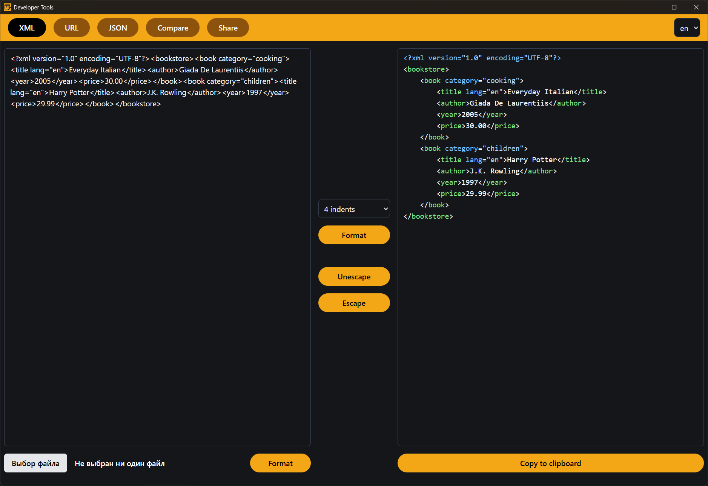

## Developer tools

1) Formatting XML, JSON
2) Escape/Unescape XML, JSON, URL
3) Supporting large files

Web version: https://dev-tools-rust.vercel.app

There are also standalone applications for Windows, Linux, and Mac OS.

https://github.com/DimetriusJonson/dev-tools/releases

The standalone app listens on port 3005 by default. This can be changed using command-line arguments.
For example,
    webdev_useful_tools.exe --port 3067

The standalone app also uses the default remote server "https://dev-tools-rust.vercel.app" for the "Share File" feature.
The server address can be changed using a command-line argument.
For example,
    webdev_useful_tools.exe --remote-server-url https://custom-server

By default, the standalone application starts a local server.
You can disable server startup with the --no-start-server option.
For example, 
    webdev_useful_tools.exe --no-start-server
The application will work with the server specified in the --remote-server-url option.