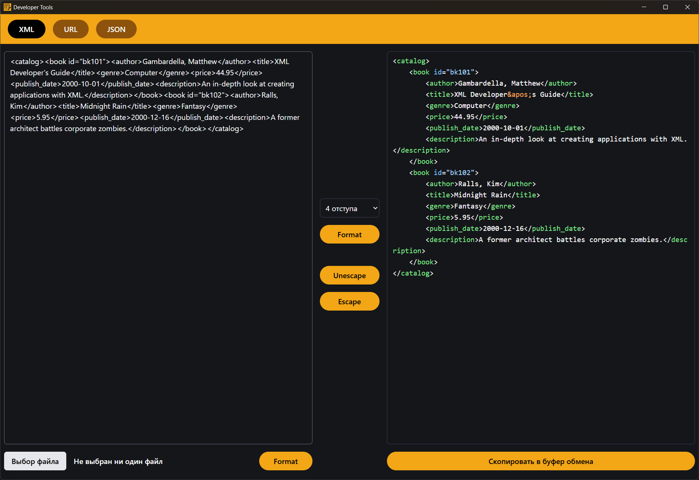
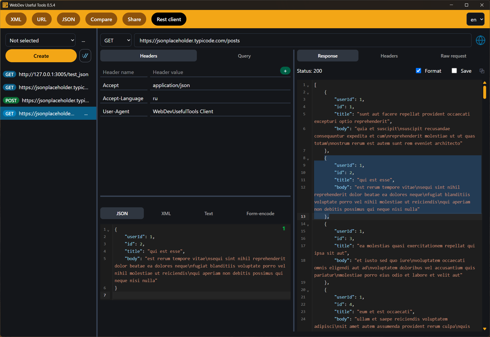

## Developer tools

1) Formatting XML, JSON
2) Escape/Unescape XML, JSON, URL
3) Compare text
4) Share file
5) Supporting large files
6) Rest client
Web version: https://dev-tools-rust.vercel.app

There are also standalone applications for Windows, Linux, and Mac OS.

https://github.com/DimetriusJonson/dev-tools/releases

The standalone app listens on port 3005 by default. This can be changed using command-line arguments. 
For example, 
    webdev_useful_tools.exe --port 3067 
 
The standalone app also uses the default remote server "https://dev-tools-rust.vercel.app" for the "Share File" feature.
The server address can be changed using a command-line argument. 
For example, 
    webdev_useful_tools.exe --remote-server-url https://custom-server 
 
By default, the standalone application starts a local server. 
You can disable server startup with the --no-start-server option. 
For example,  
    webdev_useful_tools.exe --no-start-server 
The application will work with the server specified in the --remote-server-url option.

Useful commands:

1) Build standolone app

just build-windows 
just build-linux 
just build-macos 
